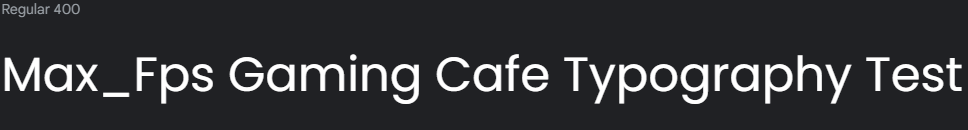

# Max_FPS Gaming Cafe

Max_FPS is a premier gaming cafe that offers high-quality gaming experiences to its customers. Located in the heart of the city, Max_FPS is the go-to destination for gamers who want to immerse themselves in the latest computer games.

With a vast collection of games available, Max_FPS offers a diverse selection of genres to suit all tastes. From action-packed first-person shooters to immersive role-playing games, Max_FPS has it all. The computers are equipped with top-of-the-line hardware to ensure that players can enjoy smooth, uninterrupted gameplay.

In addition to its impressive collection of games, Max_FPS offers a comfortable and welcoming atmosphere for gamers. The cafe is spacious and well-lit, with plenty of seating and ample room to move around. The staff are friendly and knowledgeable, and always on hand to assist customers with any questions or concerns.

Whether you're a seasoned gamer or a newcomer to the world of computer games, Max_FPS has something to offer everyone. With affordable prices and a commitment to customer satisfaction, Max_FPS is the perfect choice for gamers looking to enjoy a premium gaming experience in a relaxed and welcoming environment.

---

## CONTENTS

* [User Experience](#user-experience-ux)
  * [User Stories](#user-stories)

* [Design](#design)
  * [Colour Scheme](#colour-scheme)
  * [Typography](#typography)
  * [Imagery](#imagery)
  * [Wireframes](#wireframes)

* [Features](#features)
  * [General Features on Each Page](#general-features-on-each-page)
  * [Future Implementations](#future-implementations)
  * [Accessibility](#accessibility)

* [Technologies Used](#technologies-used)
  * [Languages Used](#languages-used)
  * [Frameworks, Libraries & Programs Used](#frameworks-libraries--programs-used)

* [Deployment & Local Development](#deployment--local-development)
  * [Deployment](#deployment)
  * [Local Development](#local-development)
    * [How to Fork](#how-to-fork)
    * [How to Clone](#how-to-clone)

* [Testing](#testing)

* [Credits](#credits)
  * [Code Used](#code-used)
  * [Content](#content)
  * [Media](#media)
  * [Acknowledgments](#acknowledgments)

---

## User Experience (UX)

👩🏻‍💻 View an example of a completed user experience section [here](https://github.com/kera-cudmore/Bully-Book-Club#user-experience-ux)

### User Stories

Add your user stories here. You want to include first time visitors and returning visitors here as a minimum. Think about each group, and the experience and journey you want them to have on your site. It really helps to think about this before you start coding, and will really help with creating your wireframes.

## Design

### Colour Scheme

We wanted to choose colours that reflected the environment of dark and gaming, so we have chosen a variety of grey, red and white for our site.

This colors are going to be implemented as 60-30-10 rule with the base of the color GunMetal. We want to have a more dark theme on the website.

The colour palette was created using the [Coolors website](https://coolors.co/aeffd8-8affc1-8fdc97-ac8887-9f4a54).

### Typography

Google Fonts was used for the following fonts:

* "Lato" is used for headings and bigger content on the site. It is a sans serif typeface family.

* "Poppins" is used for the body text, paragraphs on the site. It is a geometric, sans serif typeface family. Each letterform is nearly monolinear, with optical corrections applied to stroke joints where necessary to maintain an even typographic color.

### Imagery

All the images displayed in this site was originelly downloaded by the sites below, and modified in Photoshop.

### Wireframes

Wireframes were created for mobile and desktop. I used the webbapplication called [Balsamiq](https://balsamiq.cloud/suu74na/psiivfn/r6B57) for creating the wireframes for website Max_Fps Gaming Cafe.

Click on the links below to see an large seperated image of each page.

[Home Page](assets/images/wireframe/WireFrame-Index.png)

[About us Page](assets/images/wireframe/WireFram-about.png)

[Game Page](assets/images/wireframe/WireFrame-games.png)

[Booking Page](assets/images/wireframe/WireFrame-booking.png)

[Mobile Version Desin](assets/images/wireframe/WireFrame-mobile.png)

## Features

The website is comprised of six pages, four of which are accessible from the navigation menu (home page, about us page, gaming page & booking page). The last 2 pages is a "sign up" and "log in" which is shown in the navigation meny but cant access or use it.

* All Pages on the website have:

  * A responsive navigation bar at the top which allows the user to navigate through the site.  To the left of the navigation bar is the two links for "sign up" and "Log in". In the middle of the navigation bar an image of Max_Fps logo together with the text "Internet Cafe" can be found. To the right of the navigation bar are the links to the websites pages (home, about, gaming and booking). When viewing with mobile devices the navigation links change to a burger toggler. This was implemented to give the site a clean look and to promote a good user experience, as users are used to seeing the burger icon when on mobile devices to navigate a site.

  * A footer which contains social media icon links to all the plattforms. There is also an envelope icon which takes the user to the contact us page. Icons were used to keep the footer clean and because they are universally recognisable. There will also be a logo in the footer, just to connect the navigation bar and footer together.

* Future Implementations.
  * Want to implement the "Sign up" function. Want to have a database were members can create membership and log in to have discounts, request points. Members should have their own profile, were they can see hours played etc.
  * I want also to develop a more smoother booking system. Where the client/customer can see a map of all seats, computer available in the Gaming Cafe to click and book. Live updating booking system for better performance.

### Accessibility

I have been mindful during coding to ensure that the website is as accessible friendly as possible. I have achieved this by:

* Using semantic HTML elemts as, header(), section(), article(), footer(), nav(), details().
* Declare the Language in the beginning of every html page.
* Using descriptive ALT attributes on images and links on the site.
* Providing information for screen readers where there are icons used and no text.
* Ensuring that there is a sufficient colour contrast throughout the site.
* Ensuring menus are accessible by marking the current page as current for screen readers.

## Technologies Used

👩🏻‍💻 View an example of a completed Technologies Used section [here](https://github.com/kera-cudmore/Bully-Book-Club#Technologies-Used)

### Languages Used

Make a note here of all the languages used in creating your project. For the first project this will most likely just be HTML & CSS.

### Frameworks, Libraries & Programs Used

Add any frameworks, libraries or programs used while creating your project.

Make sure to include things like git, GitHub, the program used to make your wireframes, any programs used to compress your images, did you use a CSS framework like Bootstrap? If so add it here (add the version used).

A great tip for this section is to include them as you use them, that way you won't forget what you ended up using when you get to the end of your project.

## Deployment & Local Development

👩🏻‍💻 View an example of a completed Deployment & Local Development section [here](https://github.com/kera-cudmore/TheQuizArms#Deployment)

### Deployment

Include instructions here on how to deploy your project. For your first project you will most likely be using GitHub Pages.

### Local Development

The local development section gives instructions on how someone else could make a copy of your project to play with on their local machine. This section will get more complex in the later projects, and can be a great reference to yourself if you forget how to do this.

#### How to Fork

Place instructions on how to fork your project here.

#### How to Clone

Place instructions on how to clone your project here.

## Testing

Start as you mean to go on - and get used to writing a TESTING.md file from the very first project!

Testing requirements aren't massive for your first project, however if you start using a TESTING.md file from your first project you will thank yourself later when completing your later projects, which will contain much more information.
  
Use this part of the README to link to your TESTING.md file - you can view the example TESTING.md file [here](milestone1-testing.md)

## Credits

👩🏻‍💻 View an example of a completed Credits section [here](https://github.com/kera-cudmore/BookWorm#Credits)

The Credits section is where you can credit all the people and sources you used throughout your project.

### Code Used

If you have used some code in your project that you didn't write, this is the place to make note of it. Credit the author of the code and if possible a link to where you found the code. You could also add in a brief description of what the code does, or what you are using it for here.

### Content

Who wrote the content for the website? Was it yourself - or have you made the site for someone and they specified what the site was to say? This is the best place to put this information.

###  Media

If you have used any media on your site (images, audio, video etc) you can credit them here. I like to link back to the source where I found the media, and include where on the site the image is used.
  
###  Acknowledgments

If someone helped you out during your project, you can acknowledge them here! For example someone may have taken the time to help you on slack with a problem. Pop a little thank you here with a note of what they helped you with (I like to try and link back to their GitHub or Linked In account too). This is also a great place to thank your mentor and tutor support if you used them.
