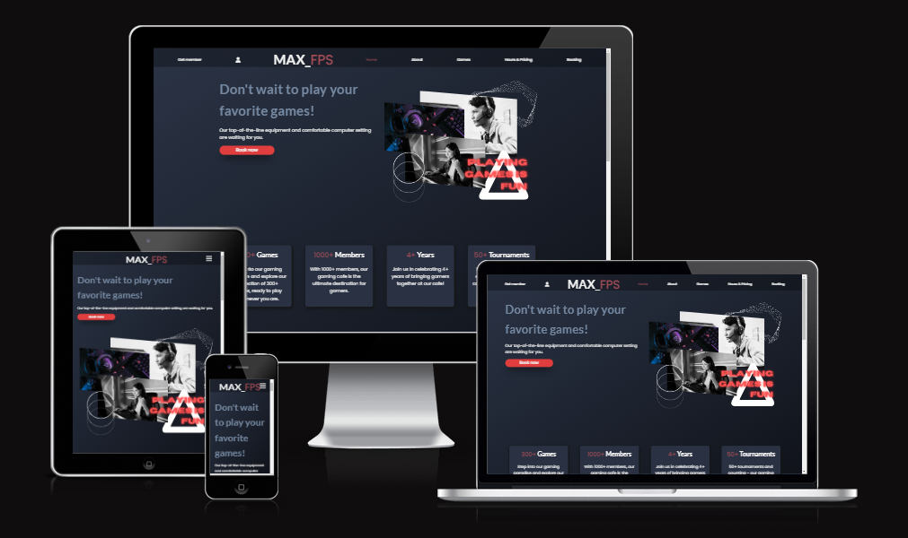
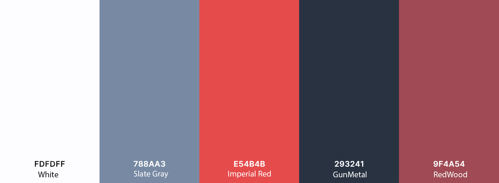
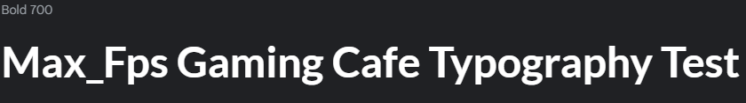
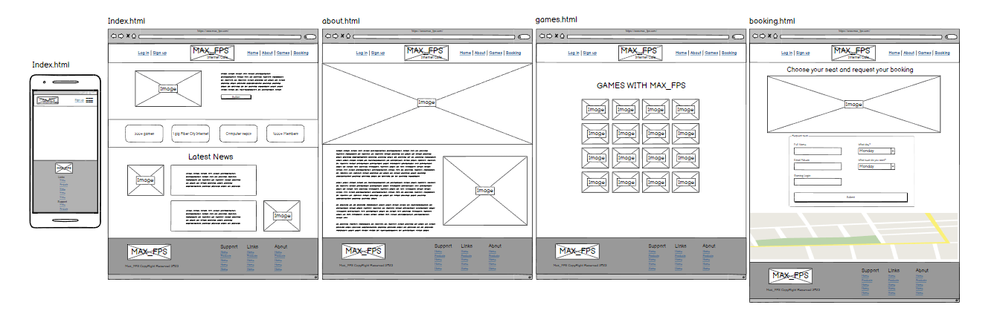
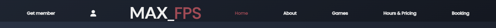
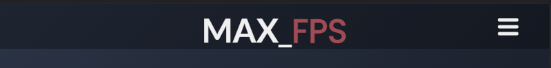
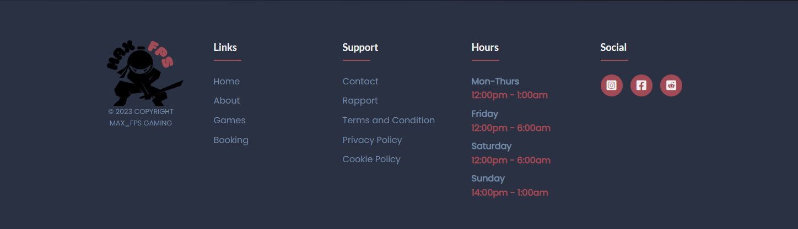

# Max_FPS Gaming Cafe 🔴

Visit the deployed site: [Max_fps Gaming Cafe](https://kimbergstroem.github.io/PP1/)

Max_FPS is a premier gaming cafe that offers high-quality gaming experiences to its customers. Located in the heart of the city, Max_FPS is the go-to destination for gamers who want to immerse themselves in the latest computer games.

With a vast collection of games available, Max_FPS offers a diverse selection of genres to suit all tastes. From action-packed first-person shooters to immersive role-playing games, Max_FPS has it all. The computers are equipped with top-of-the-line hardware to ensure that players can enjoy smooth, uninterrupted gameplay.

In addition to its impressive collection of games, Max_FPS offers a comfortable and welcoming atmosphere for gamers. The cafe is spacious and well-lit, with plenty of seating and ample room to move around. The staff are friendly and knowledgeable, and always on hand to assist customers with any questions or concerns.

Whether you're a seasoned gamer or a newcomer to the world of computer games, Max_FPS has something to offer everyone. With affordable prices and a commitment to customer satisfaction, Max_FPS is the perfect choice for gamers looking to enjoy a premium gaming experience in a relaxed and welcoming environment.

---

## CONTENTS 🔴

* [User Experience](#user-experience-ux)
  * [User Stories](#user-stories)

* [Design](#design)
  * [Colour Scheme](#colour-scheme)
  * [Typography](#typography)
  * [Imagery](#imagery)
  * [Wireframes](#wireframes)

* [Features](#features)
  * [General Features on Each Page](#general-features-on-each-page)
  * [Future Implementations](#future-implementations)
  * [Accessibility](#accessibility)

* [Technologies Used](#technologies-used)
  * [Languages Used](#languages-used)
  * [Frameworks, Libraries & Programs Used](#frameworks-libraries--programs-used)

* [Deployment & Local Development](#deployment--local-development)
  * [Deployment](#deployment)
  * [Local Development](#local-development)
    * [How to Fork](#how-to-fork)
    * [How to Clone](#how-to-clone)

* [Testing](#testing)
  * [Bugs](#Bugs)
  * [Validation](#Validation)

* [Credits](#credits)
  * [Code Used](#code-used)
  * [Content](#content)
  * [Media](#media)
  * [Acknowledgments](#acknowledgments)

---

## User Experience (UX) 🔴

#### Key information for the site

* What is the current Games available and what to play.
* What are the opening hours and how to book a place for gaming.
* How to become a member and take part of the gaming community.
* Be a part of tournaments, promotions, discount and events.
* Contact information and were Max_Fps gaming cafe are.

### User Stories

#### Client Goals

* To be able to view the site on a range of device sizes.
* To make it easy to register as a member.
* Continuously improve services and offerings based on customer feedback.
* Offer special promotions, events and tournaments to enhance customer experiences.
* Establish Max_FPS as a premier gaming destination in the city.
* Increase visibility and awareness of the cafe to attract new customers in all ages, young as old people.

#### First Time Visitor Goals

* Feel comfortable and welcomed in the spacious and well-lit gaming atmosphere.
* Navigate the site easily to find information as booking, opening hours and contact information.
* Leave with a positive impression and desire to return.
* Easily take part of any tournamnet or promotion.

#### Returning Visitor Goals

* Feel comfortable and welcomed in the familiar and inviting atmosphere.
* Feel safe and secure in the environment provided by the cafe.
* Establish a sense of community with other gamers who are also regulars at the cafe.
* Participate in gaming events or tournaments and meet other gamers with similar interests.
* Collaborate with other gamers to play co-op games or to form teams for competitive play.
* Engage in friendly competition and develop healthy rivalries with other regulars.
* Create a sense of belonging and feel like part of the Max_FPS gaming community.
* Share gaming knowledge and skills with other gamers, and learn from them in return.
* Look forward to returning to Max_FPS as a place where they can both have fun and feel like they are part of a welcoming and inclusive community.

#### Frequent Visitor Goals

* Become an expert in their favorite games and challenge themselves to improve their skills.
* Maintain and strengthen relationships with the staff and other regulars at the cafe.
* Participate in gaming events or tournaments regularly and compete against other skilled gamers.
* Collaborate with other gamers to form teams for competitive play, and strive for excellence together.
* Help new visitors feel welcome and share their knowledge of the games and the cafe with others.
* Continuously provide feedback to the cafe about their experiences and suggest ways to improve the offerings and services.
* Take advantage of any loyalty programs or rewards offered by the cafe for frequent visitors.
* Look forward to returning to Max_FPS as a place where they can both have fun and continue to grow their skills and relationships.

--- 

## Design 🔴

### Colour Scheme

We wanted to choose colours that reflected the environment of dark and gaming, so we have chosen a variety of grey, red and white for our site.

This colors are going to be implemented as 60-30-10 rule with the base of the color GunMetal. We want to have a more dark theme on the website.

The colour palette was created using the [Coolors website](https://coolors.co/aeffd8-8affc1-8fdc97-ac8887-9f4a54).

### Typography

Google Fonts was used for the following fonts:

* "Lato" is used for headings and bigger content on the site. It is a sans serif typeface family.

* "Poppins" is used for the body text, paragraphs on the site. It is a geometric, sans serif typeface family. Each letterform is nearly monolinear, with optical corrections applied to stroke joints where necessary to maintain an even typographic color.

### Imagery

All the images displayed in this site was originelly downloaded by the sites below, and modified in Photoshop.

### Wireframes

Wireframes were created for mobile and desktop. I used the webbapplication called [Balsamiq](https://balsamiq.cloud/suu74na/psiivfn/r6B57) for creating the wireframes for website Max_Fps Gaming Cafe.

Click on the links below to see an large seperated image of each page.

[Home Page](assets/images/wireframe/WireFrame-Index.png)

[About us Page](assets/images/wireframe/WireFram-about.png)

[Game Page](assets/images/wireframe/WireFrame-games.png)

[Booking Page](assets/images/wireframe/WireFrame-booking.png)

[Mobile Version Desin](assets/images/wireframe/WireFrame-mobile.png)

--- 

## Features 🔴

The website is comprised of seven pages, four of which are accessible from the navigation menu (home page, about us page, games page & booking page). The last 3 pages are a "sign up", "log in" and "hours & pricing" which is shown in the navigation meny but cant access or use it.

* All Pages on the website have:
  * A responsive navigation bar at the top which allows the user to navigate through the site.  To the left of the navigation bar is the two links for "sign up" and "Log in". In the middle of the navigation bar an image of Max_Fps logo.. To the right of the navigation bar are the links to the websites pages (home, about, games, pricing and booking). When viewing with mobile devices the navigation links change to a burger toggler. This was implemented to give the site a clean look and to promote a good user experience, as users are used to seeing the burger icon when on mobile devices to navigate a site.
  
  

  * A footer which contains social media icon links to all the plattforms along with other importent links as companys policy and regulation. There is also an company logo which takes the user to the contact us page. Icons were used to keep the footer clean and because they are universally recognisable and attract more young audience. The footer is also including the opening hours as this information are crusial for the user experience. Important information are in the footer.
  

* Future Implementations.
  * Want to implement the "Sign up" function. Want to have a database were members can create membership and log in to have discounts, request points. Members should have their own profile, were they can see hours played etc.
  * I want also to develop a more smoother booking system. Where the client/customer can see a map of all seats, computer available in the Gaming Cafe to click and book. Live updating booking system for better performance.

### Accessibility

I have been mindful during coding to ensure that the website is as accessible friendly as possible. I have achieved this by:

* Using semantic HTML elemts as, header(), section(), article(), footer(), nav(), details().
* Declare the Language in the beginning of every html page.
* Using descriptive ALT attributes on images and links on the site.
* Using a hover state on all buttons on the site to make it clear to the user if they are hovering over a button or not.
* Providing information for screen readers where there are icons used and no text.
* Ensuring that there is a sufficient colour contrast throughout the site.
* Ensuring menus are accessible by marking the current page as current for screen readers.

--- 

## Technologies Used 🔴

### Languages Used

Hyper Text Markup Language (HTML) and Cascading Style Sheets (CSS) were used to create this website.

### Frameworks, Libraries & Programs Used

[Balsamiq](https://balsamiq.cloud/) - Used to create wireframes.

[Git](https://git-scm.com/) - For version control.

[Github](https://www.github.com/) - To save and store the files for the website.

[Google Fonts](https://fonts.google.com/) - To import the fonts used on the website.

[Font Awesome](https://fontawesome.com/) - For the iconography on the website.

Google Dev Tools (Google Browser) - To troubleshoot and test features, solve issues with responsiveness and styling.

[Tiny PNG](https://tinypng.com/) To compress images.

[Favicon.io](https://favicon.io/) To create favicon.

[Am I Responsive?](http://ami.responsivedesign.is/) To show the website image on a range of devices.

[Shields.io](https://shields.io/) To add badges to the README

--- 

## Deployment & Local Development 🔴

Github Pages was used to deploy the live website. The instructions to achieve this are below:

1. Log in (or sign up) to Github.com.
2. Find the repository for this project, "PP1".
3. Click on the Settings link.
4. Click on the Pages link in the left hand side navigation bar.
5. In the Source section, choose main from the drop down select branch menu. Select Root from the drop down select folder menu.
6. Click Save. Your live Github Pages site is now deployed at the URL shown.

### Deployment

Include instructions here on how to deploy your project. For your first project you will most likely be using GitHub Pages.

### Local Development

#### How to Fork

To fork the PP1 repository:

1. Log in (or sign up) to Github.
2. Go to the repository for this project, https://github.com/KimBergstroem/PP1.
3. Click the Fork button in the top right corner.

#### How to Clone

To clone the PP1 repository:

1. Log in (or sign up) to GitHub.
2. Go to the repository for this project, https://github.com/KimBergstroem/PP1.
3. Click on the code button, select whether you would like to clone with HTTPS, SSH or GitHub CLI and copy the link shown.
4. Open the terminal in your code editor and change the current working directory to the location you want to use for the cloned directory.
5. Type 'git clone' into the terminal and then paste the link you copied in step 3. Press enter.

--- 

## Testing 🔴

### Buggs

Throughout the entire build, I conducted ongoing testing and utilized Chrome developer tools to identify and troubleshoot any issues as they arose.

### Validation

#### W3C Validator

The W3C validator was used to validate the HTML on all pages of the website. It was also used to validate CSS in the style.css file.

* [Index.html](docs/testing/w3c/w3cindex.png)
* [Aboutus.html](docs/testing/w3c/w3cbooks.png)
* [Games.html](docs/testing/w3c/w3ccontact.png)
* [Booking.html](docs/testing/w3c/w3cthankyou.png)

## Credits 🔴

The Credits section is where you can credit all the people and sources you used throughout your project.

### Code Used

* I used this YouTube tutorial to learn how to create and play with the responsiveness of a website along with otherstuff as hover effect.

[Kevin Powell](https://www.youtube.com/@KevinPowell)

### Content

More information will come, but for now im the only one writing the code.

###  Media

More informaiton will come.
  
###  Acknowledgments

More information will come, when my project are finished.

* [Naoise Ganney](https://github.com/NaoiseGaffney), my Code Institute Mentor.

--- 
